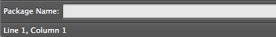
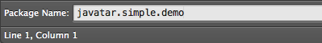
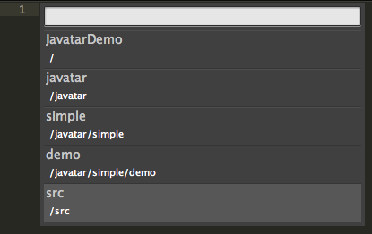
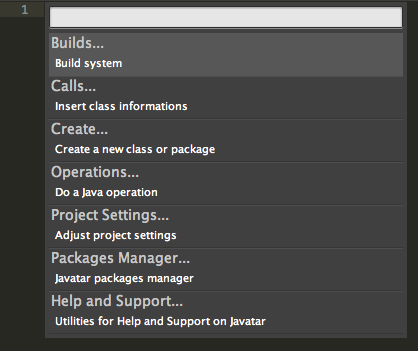
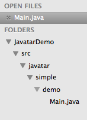
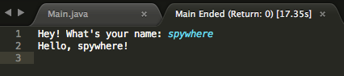

.. include:: definitions.inc

.. _getting_started:

Getting Started
===============

Welcome you, the new Javatar! I will take you through a simple project to help using |J| faster and better suit your workspace.

This should take some time since I am going to explain everything you might need to know. But in a normal work, you would done all of this in a few minutes.

In the end of this chapter, we will see a simple application that take our input and respond to us.

If you are ready, let's begin!

Startup
-------

|J| is designed to be ready out of the box.
At startup, |J| will load their snippets, packages and check for any available :ref:`additional_packages` and later,
you might see a notification display some important update messages.

If you run |J| for the first time, it also download and install necessary packages (Java SE) for you too.

.. image:: images/gettingstarted/status_installing.png

Usually, you can use |J| right away when you open |st| since most users did not start create a new class or organize imports at startup time.

Preparing Our New Project
-------------------------

To prepare our project, we need to create a folder to contains our files then open it in |st| and do not forget to create ``src`` folder to store our Java source code.

.. image:: images/gettingstarted/sidebar_folder.png

First Command
-------------

Let's try working with a command. First, we need to create a new package to test some Java code.

We will pressing :kbd:`Key+Shift+K` twice to open |J|'s menu and select *Create... > Package* to open up input box.

.. note:: :kbd:`Key` is :kbd:`Control` on Windows, Linux and :kbd:`Command` on OS X.

Then type ``javatar.simple.demo`` and hit :kbd:`Enter` or :kbd:`Return`.

And there it is! Our first package.

.. image:: images/gettingstarted/sidebar_wrong.png

But unfortunately, our package is ends up in a wrong place.
We want our package to be created inside ``src`` folder.
Why is that? There is a reason...

Source Folder
-------------

The reason that our package ends up in a wrong place because we did not set the source folder yet.
What is source folder? Source Folder is, obviously, a folder which contains source code files.
Since, we want our source code to be placed inside ``src`` folder. Hence, the ``src`` folder should be set as source folder as the name stated.

To set a source folder, we will run a command *Set Source Folder*.
We will pressing :kbd:`Key+Shift+K` twice again to open |J|'s menu and select *Project Settings... > Set Source Folder*

Then we will select ``src`` folder as we want.

.. warning:: Source Folder and Dependencies settings will be reset if you do not save your project.

Menu is Everything
------------------

As you can see, |J| use menu instead of Command Palette to help group commands to a single submenu.
This helps find commands easier when you do not know which command you are looking for.

And also |st| did not support dynamic Command Palette since |J| need to add or remove an action from snippets, packages or your project's dependencies list.

First Class
-----------

After we set a source folder, it is time to recreate that package again (do not forget to remove an old one too!) but since we are going to create a class later,
we will try a faster command that let's us create both package and class at the same time.

Press :kbd:`Key+Shift+K` twice and select *Create... > Class* and it will wait for us to enter a class name.

Enter ``javatar.simple.demo.Main`` and hit :kbd:`Enter` or :kbd:`Return` to create it.

And bam! A class is create inside a proper package path. Isn't that great?

So, Create Package command is useless? Well, not so much. Sometimes you might need to create a package before create a class to organize packages,
and later you will filled it up with a bunch of classes. And that is time when Create Package comes in.

Package Path
------------

Right now, if you look at your status bar at the bottom of the window, you will notice that there is package path showing.
This will changed when you switch to another tabs that is Java file, indicated which package current file is in.

.. image:: images/gettingstarted/status_package_path.png

Coding Time!
------------

It is fun time! Let's code a simple application that take our name and display "Hello, <Name>!"

.. code-block:: java

	package javatar.simple.demo;

	import java.util.Scanner;

	public class Main {
		public static void main(String[] args) {
			Scanner sc = new Scanner(System.in);
			System.out.print("Hey! What's your name: ");
			String name = sc.nextLine();
			System.out.println("Hello, " + name + "!");
		}
	}

Build Our Project
-----------------

We just done our first Java coding. Let's build and run it!

Select *Builds... > Project* from the menu and wait...

If something is wrong, |J| will show you in a new view.

Running Our Code
----------------

It is time to test our application. To run just select *Builds... > Run Main Class* and |J| will launch our application on a new view.

.. image:: images/gettingstarted/running.png

If application exit properly, |J| will show return code in a tab. But if you want to force quit an application, just close the view and an application will be terminated.

Final
-----

And you just learn most parts of |J| by now. Explore it! Try download some packages if you need!

And Happy Coding!